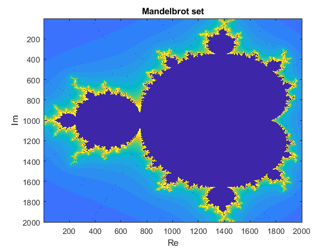

# Mandelbrot Set

## Descrizione

Questo progetto genera e visualizza il **Set di Mandelbrot**, un frattale definito dalla funzione iterativa:

$$
z_{n+1} = z_n^2 + c
$$

Il programma calcola se ogni punto complesso \( c \) appartiene al Set di Mandelbrot verificando se la sequenza iterativa diverge.

## Funzionamento

- Il piano complesso viene scandito all'interno di un intervallo definito (`xa` a `xb`, `ya` a `yb`) con una certa precisione.
- Per ogni punto \( c \), viene iterata la formula $ z_{n+1} = z_n^2 + c $ a partire da $ z_0 = 0 $.
- Se il modulo di \( z \) supera il valore 2, il punto è considerato divergente e viene registrato il numero di iterazioni.
- Il risultato finale viene visualizzato con una mappa colori 2D.

## Programmi utilizzate

- MATLAB
- Funzionalità base: cicli `for`, numeri complessi, generazione di immagini

## Esempio

## File contenuti

- `MandelbrotSet.m`: Script principale per il calcolo e la visualizzazione del set.
- `README.md`: Questo file.
- `Mandelbrot.png`: Immagine esplicativa

##  Note

In futuro sarà aggiunta anche una **versione Python** per rendere il progetto accessibile a un pubblico più ampio e mostrare versatilità su più linguaggi.

Il progetto è stato realizzato come esercizio personale di analisi dati.

~ Loris Manganiello
